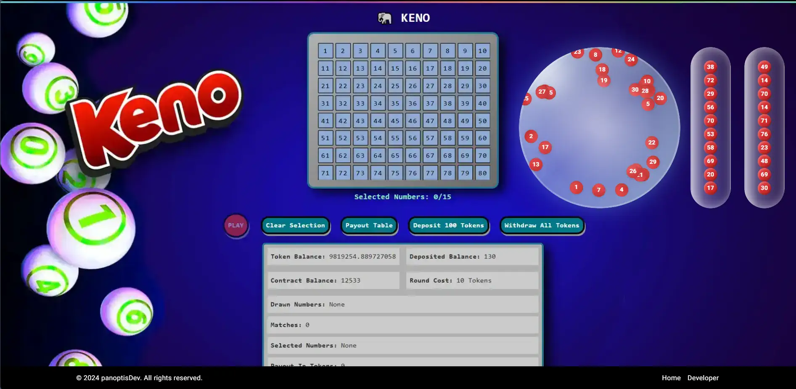

### Typescript Components for lottery app 

This is a Ball Blower animation i did for my keno dapp its really nice looking and i thought someone else might find use for it in his game. Ball Tubes have balls dropping down in them, 10 balls in each tube. all is easy to modify using the comments i added. 


### to build
```bash
use nvm 20.16.0
yarn
yarn dev
```

### Tools: 
framer-motion, nextjs v14, react, tailwind, Typescript. 

### stand alone components
you can use BallBlower sphere separate from tubes and vice versa.

### add your own background
i took a screen dump of my dapp to show case how to use the components

### Devs 
these components are my gift to my fellow developers to use in your projects
built by panoptisDev 2024-12-21 

* it is just the components not the full working dapp.